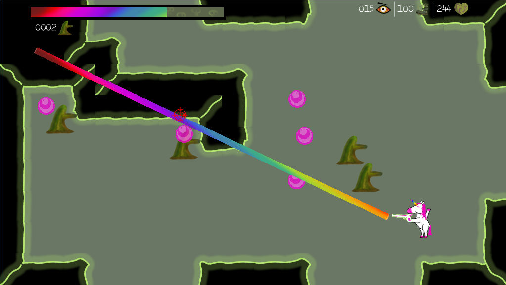

# Rlyeh survivors

`ph'nglui mglw'nafh Cthulhu R'lyeh wgah'nagl fhtagn`

Rlyeh survivors is an isaac life, where you can collect different kinds of coins and trade it to buy
weapons. But everything came at a cost. When you trade coin, you get a debuff acording what kind of
coin you trade. While rotten earth apply life debuff, the rotten shoes make you slower.
So choose carefully...

Will you survive Rlyeh ?

# Play the game

## Online
[Play online](https://ludum-rlyeh.github.io/rlyeh-survivors/)

## The source code
[Source code](https://github.com/ludum-rlyeh/rlyeh-survivors)

## Screenshots

